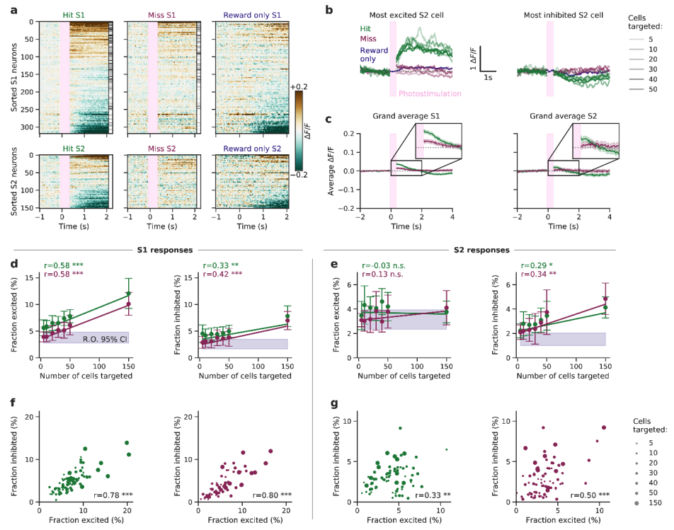
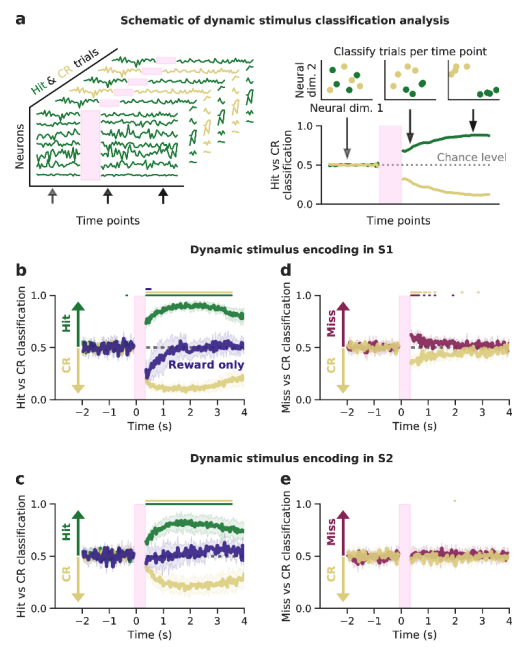
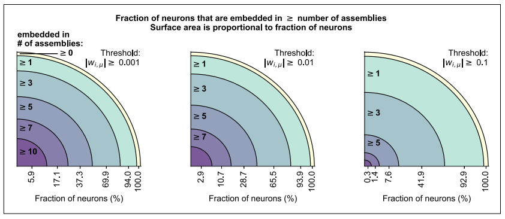
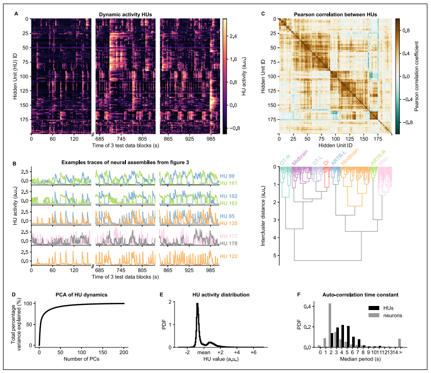
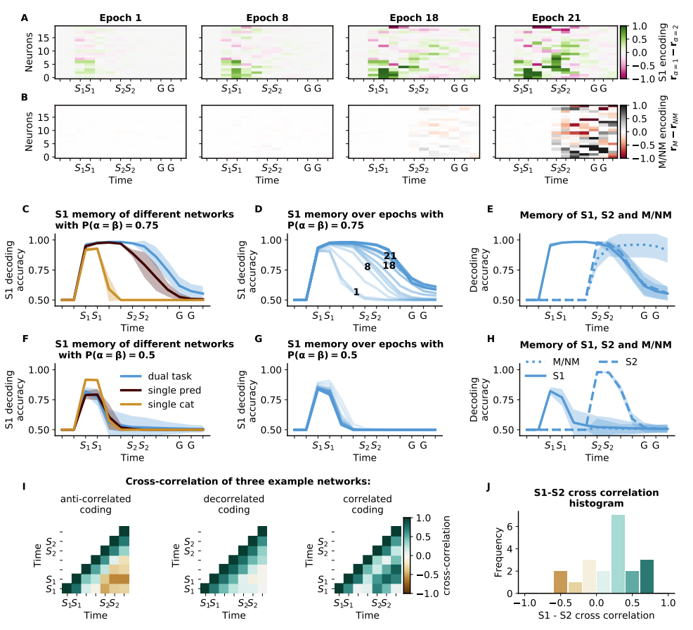

## Gallery of published papers with reproducible figures
_Please suggest any papers you know (via pull request) to be added to this list!_

The goal of this collection is to give some inspiration. Look at the figures here, and if you see elements of a figure that you like and/or want to incorporate into your work, you can just look up and use the underlying code! 

#### Conditions to be included:
- Paper/figure must be open-access (i.e., publicly available)
- Code must be available and open-source (please include a link)
- Code must clearly show where figure was created (preferably, in a Jupyter notebook where the output of a cell is the figure as a whole)

## Gallery:

Sources: [Paper (figure 2)](https://www.biorxiv.org/content/10.1101/2021.12.28.474343v2.full.pdf) and [Code figure](https://github.com/Packer-Lab/popping-off/blob/master/notebooks/Paper%20Figures/Figure2.ipynb)

---

Notes: Schematic in a was created using `matplotlib`. 

Sources: [Paper (figure 3)](https://www.biorxiv.org/content/10.1101/2021.12.28.474343v2.full.pdf) and [Code figure](https://github.com/Packer-Lab/popping-off/blob/master/notebooks/Paper%20Figures/Figure3.ipynb)

---

Sources: [Paper (figure 2 - figure supplement 4)](https://elifesciences.org/articles/83139) and [Code figure](https://github.com/vdplasthijs/zf-rbm/blob/master/figure_notebooks/fig_structure_dynamics.ipynb)

---

Sources: [Paper (figure 4)](https://elifesciences.org/articles/83139) and [Code figure](https://github.com/vdplasthijs/zf-rbm/blob/master/figure_notebooks/fig_structure_dynamics.ipynb)

---

Sources: [Paper (figure 3)](https://proceedings.mlr.press/v199/plas22a.html) and [Code figure](https://github.com/vdplasthijs/eavesdropping/blob/master/Figure%20generation%20notebook.ipynb)